# Hangman
## About
The Hangman Game is a classic word guessing game that challenges players to unravel a secret word. The task is to guess the word by guessing a letter one at a time. However, be careful! If you guess an incorrect letter, you will lose a life, and a body part of the hangman figure will be drawn.

Prepare yourself to get focused. Whether you choose to play solo or in a group, the Hangman Game guarantees hours of fun while at the same time expanding your vocabulary!

The application can be accessed by this [link](https://bianca9901.github.io/cheers-quiz/)

The sites repository can be accesed by this[]link

Note: this application can only run on pc.

---

## How to play:
1. Click/Copy this link "..."

2. If you are familiar with the hangman game. Press enter to play. Otherwise, press the downward direction arrow on you keyboard, then press enter. This will take you to the instructions. Press enter again to go back to the main menu.

3. When you decide to play, you are prompted to make your first guess. Press a letter on your keyboard and then press enter.

4. When you have used all of your lives, or figured out the correct word, You will be presented with a "Go back" option. Press enter and you are taken back to the main menu. Press play to start the game again and you will get a new word. Good luck and have fun!

Here is a picture so that you can get a visual understanding of the navigation throughout the application!

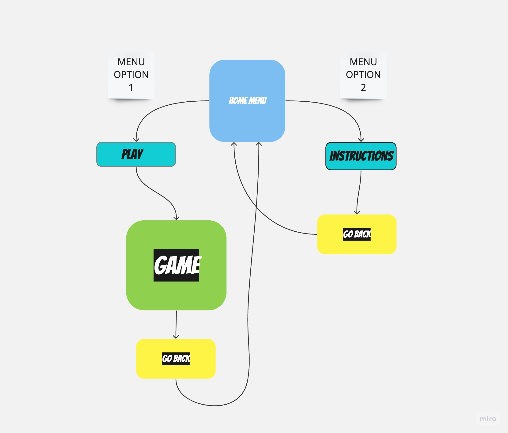
---
## User Stories

### **First-Time Visitor Goals:**

* As a first-time visitor my goal is to try the Hangman Game application and understand its purpose by reading the instructions.

* As a first-time visitior my goal is to play the game so that I can understand its features.

### **Returning Visitor Goals:**

* As a returning visitor my goal is to play the game to see if my guessing skills has improved.

### **Frequent Visitor Goals:**

* As a frequent visitor my goal is to play multiple times so that I can test my focus and luck.

* As a frequent visitor my goal is to play the game so that I can improve my english vocabulary.

## Existing features

### The home menu:
* Consists of two options. "Play" and "Instructions"
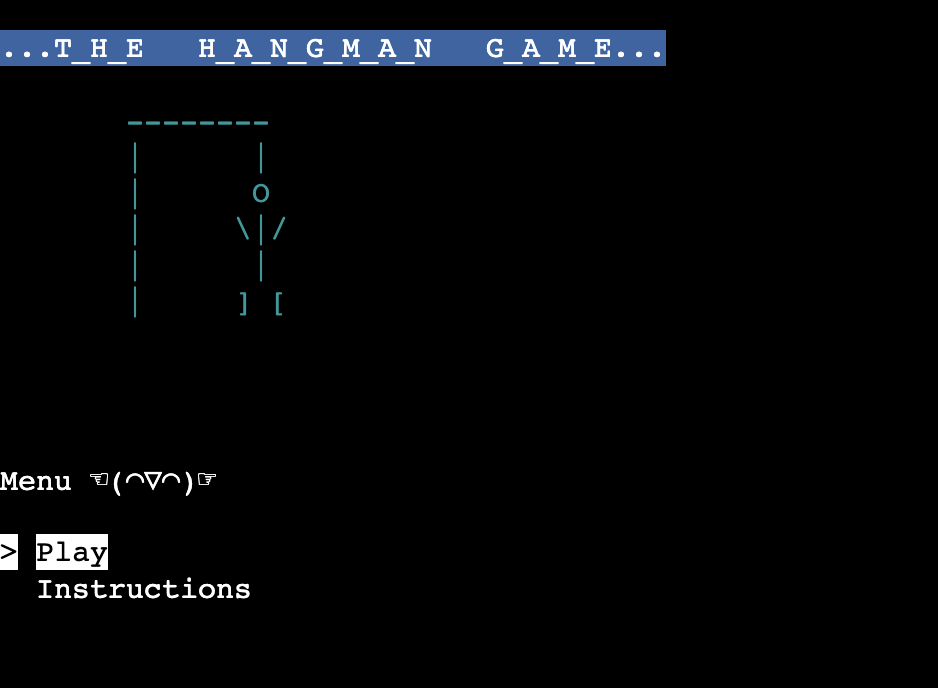

### The instructions:
* The instructions give a simple explanation of what the game is about. The player can then click on the "Go Back" button by pressing enter. This will take the player back to the home menu.
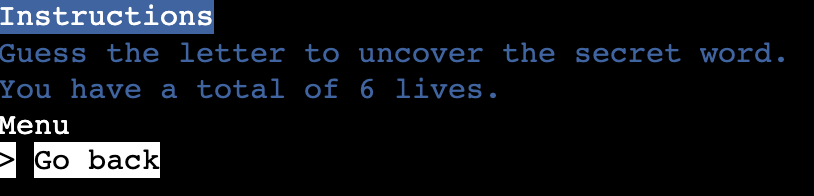

### The Game:
1. The game begins with a welcoming message.

2. It then displays messages to give assurance to the player that the game has started.
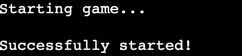
3. It then displays the text ''You have 6 lives'' which is the lives (guessing chances) the player will start with. 
4. It also displays the hangman stage, that at the moment is only a pole. 
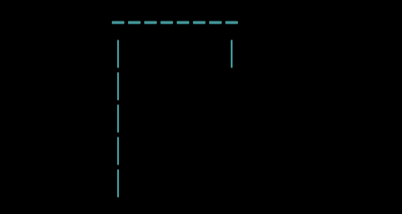
5. Underneath the hangman stage, underscores is displayed, the number of underscores is the number of letters. Each underscore represents a hidden letter. For example, "_ _ _ _ _ _ _ _ _ " would be a word containing nine letters.                

6. Underneath the underscores the player is presented with an input field. "Guess a letter:" The player is prompted to type their guess.                         
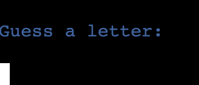 
- If the guess would be anything other than a single letter, the player will get a message saying "Invalid guess! Please enter a single letter.". However, this will not affect their remaining lives, the input field will just repeat itself and the player will have to try again. 
7. If the player guesses an incorrect letter, the first body part (the head of the hangman figure) will be drawn, and the lives will decrease to 5. 
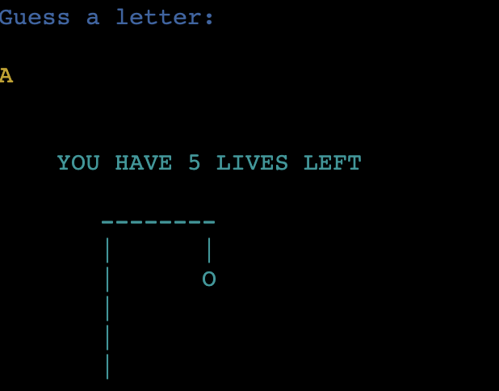
* Important: If an incorrect letter is guessed once again, a life will be taken once again, therefore, the player has to work on their memory skills/or scroll up to see if they had already guessed that letter.
8. If the player guesses a correct letter, the underscore that contains that/or those letters will be filled in. 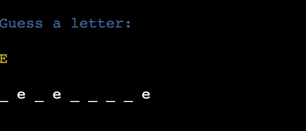
9. The game will continue as explained above until the player has guessed the correct word or if the player has used all of their 6 lives.
* If the player loses. They will get a message saying "YOU LOSE!" and they will, at last, know what the secret word was.      

* If the player unravels the secret word, they will be presented with a message saying "YOU WON!".
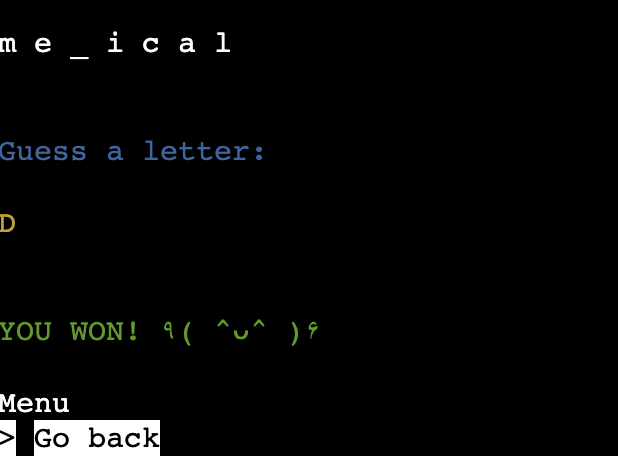
* Either if the player wins or loses, they will get a button that if pressed enter, will take them back to the home menu.           

10. The player is then taken back to the main menu.

---

## Features left to Implement

* At the moment, the player has to remember prevouisly guessed incorrect letters. Even though this could be seen as a part of the game (to remember or to scroll up to remind themselves if they had already guessed that letter), In the future I do want to implement a logic that as soon as the player redo's a guess, I wan to make a collection of letters that have already been guessed, displaying all of them right next to the input field. I would also like to implement a message saying "You have already guessed that letter".

---

## Data structures

Throughout the whole development, data structures were used to support the logic of the project.
* Lists were used to store and manage certain aspects of the program, such as the menu options and the words for the hangman game.
* Strings were used to handle and manipulate text within the program, such as the instructions, menu titles, and messages.

These data structures were used to achieve the functionality of the game and to provide an engaging user experience.
___

## Technologies used

### Languages:
* [Python](https://www.python.org/) was used to make the game.

### Frameworks/Libraries, Programmes and Tools:
#### Python modules/packages:
#### Standard library imports:
* [Random](https://docs.python.org/3/library/random.html) was used to randomize the words for each round.
* [Os](https://docs.python.org/3/library/os.html) was used to clear the terminal.

#### Third party imports:
* [Colorama](https://pypi.org/project/colorama/) was used to make the game colorful.
* [Simple term menu](https://pypi.org/project/simple-term-menu/) was used to make the menus.

#### Other tools:
* [Github](https://github.com/)
was used to host the code on the website.
* [Git](https://git-scm.com/)
was used for version control.
* [Visual studio code](https://code.visualstudio.com/)
was used to write the code.
* [FLOW](..) ASK WHAT FLOWCHART WEBSITE J USED.
* [Heroku](https://id.heroku.com/login) was used to deploy the project.

---

## Testing
Please visit [this link](TESTING.md) to find all test-related documentation.

---
## Bugs

### Solved Bugs

* Initially, it was an issue with colorama. The selected color would persist and affect all upcoming print statements. 

* I fixed it with the help of [this](https://www.youtube.com/watch?v=u51Zjlnui4Y) video. The solution was to implement a parameter called "autoreset=true" to the colorama module.

* The bug was fixed and afterwards I could apply colors to specific print statements without any concerns.

### Unsolved bugs
None
### Mistakes

In the initial version of my game, I had only one section for all of the code. In this section, I relied heavily on if/else/elsif statements. This quickly became messy and hard to maintain. However, after having my first project portfolio talk with my mentor, I realized the need for a better structure. Together we made a flowchart and after that I made huge improvements by:
* Defining a lot more functions.
* Creating two sections, "Game()" and "Main()".
* In the game() section, I implemented the core of the game. Including some, but not all statements, (such as the code responsible for the hangman stages updating and input validation, etc.)
* Giving the main() section the responsibility to hold the previously mentioned newly defined functions, such as "game()" and "instructions()".

These changes made it possible to delete excessive nested if/elif/else statements. It also made the code more organized and readable by implementing two sections for the game, one whose responsibility was to hold the logic, and one whose responsibility was to hold the execution. The code is now clean and maintainable and repetition is avoided.

This misstake reminded me of the power of flowcharts. The misstake will also influence future projects positively, as I now recognize the importance of detailed planning instead of relying on an overall plan. 

--- 

## Deployment

The project was deployed to Heroku.
The project can be accesesed by this link.

To run this project locally:

1. This project requirers Python to be installed. Click [here](https://www.python.org/) to download.
2. This project contains python packages and dependencies. Therefore, you need to install pip. To Install pip you type `sudo apt install python3-pip` in your terminal.
3. Clone this repository by opening your terminal and paste this `git clone https://github.com/bianca9901/hangman.git`

To deploy to Heroku:

1. Sign up to Heroku. Click [here](https://signup.heroku.com/login)

2. Click on the "Create new app" button that is displayed on the dashboard.
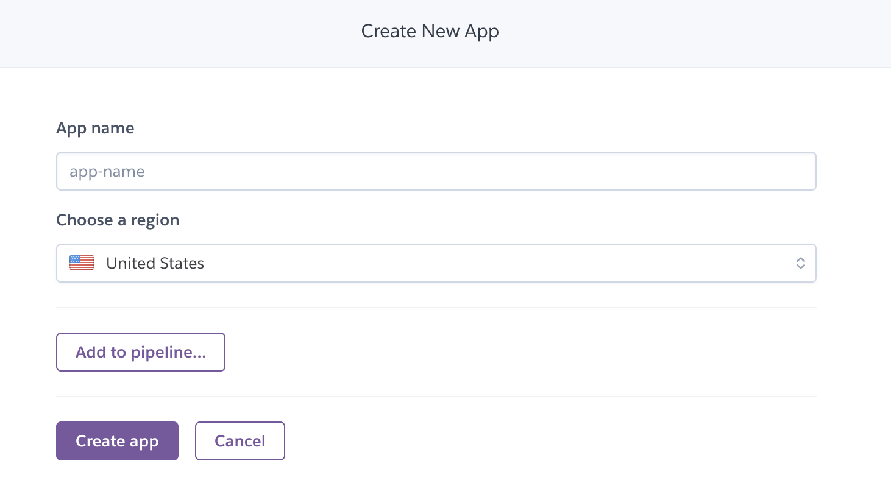

3. Select a name for your app, and choose your region. Then click "Create app". This will take you to your newly created applications' information page.
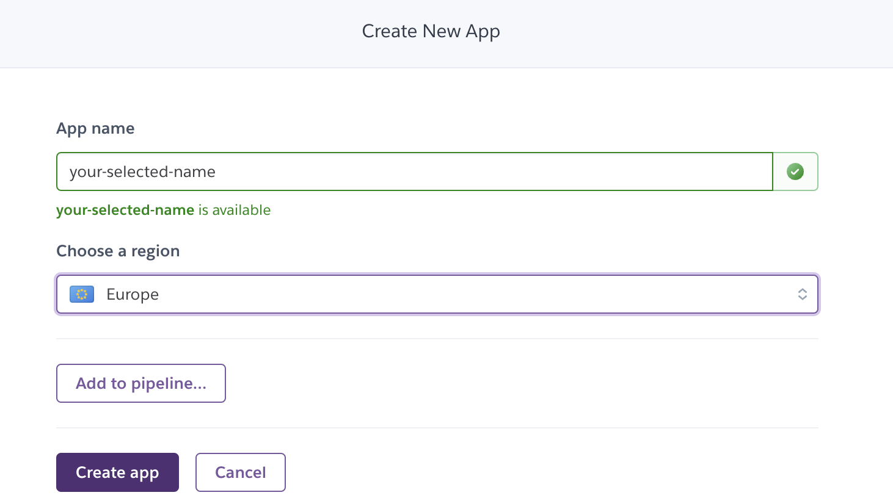

4. Click on "Settings".
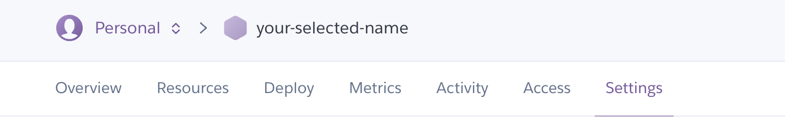
 Scroll down to Config Vars. Now click "Reveal Config Vars".
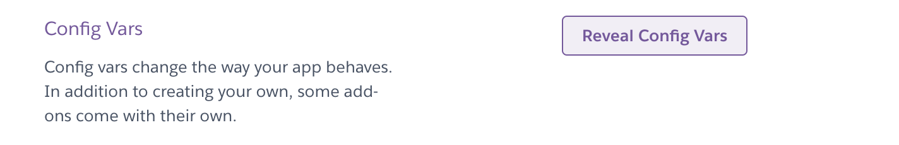
 In the field for "KEY" type PORT, in the field for "VALUE" type 8000, and then click add.

5. Scroll further down and you will see "Buildpacks". Now click "Add buildpack".   
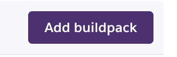   
  Click on the Python icon, and then click on the save changes button. Then click "Add buildpacks" again, this time, click on the NODE.JS icon and then click on the save changes button. Make sure Python is first in this list, and that NODE.JS is underneath. The order is important.

6. Scroll back up to the settings bar, and click on Deploy. In the "Deployment method" section, click on GitHub. Then click on "Connect to GitHub".
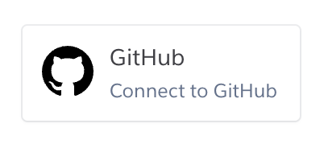

7. Search for your GitHub repository name, when this is filled in, you will be able to click "connect".
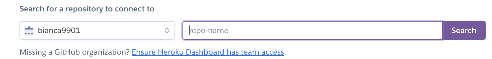
8. Scroll down to the "Manual deploy" section and click on "Deploy Branch"
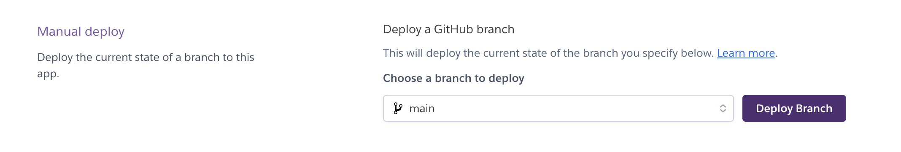

9. After the app has been built, you will see a message "Your app has succesfully deployed" underneath this text you can click on the "View" button, this is a link that will take you to your deployed application.

---

## Credits

* [Colorama](https://pypi.org/project/colorama/) was used to implement colors.
* [Simple terminal menu](https://pypi.org/project/simple-term-menu/) was used to implement the menus. 
* [Heroku](https://id.heroku.com/login) was used to deploy my project.
* [This](https://www.youtube.com/watch?v=u51Zjlnui4Y) video helped me learn how to reset the previously used color to default so that I could always start with a clean slate. 
* [This](https://www.csestack.org/clear-python-interpreter-console/) article together with the inspiration from my mentor teached me how to clear terminals.
* [This](https://www.youtube.com/watch?v=Zpa-rc9e388) video together with the tips from my mentor teached me how to create menus.
* [This](https://www.youtube.com/watch?v=cJJTnI22IF8) video gave me the idea to make the hangman game.  
* [This](https://www.youtube.com/watch?v=tMJbCWHAWQ4) video was great for inspiration and planning the structure of the game. 
* [These](https://github.com/kying18/hangman/blob/master/hangman_visual.py) figures of the hangman stages inspired me to make my own figures to implement to my game.
* [This](https://github.com/kying18/hangman/blob/master/words.py) is where the words for the game were taken from. (In my game the words with hyphen-minus were deleted).
* [This](https://www.youtube.com/watch?v=u51Zjlnui4Y) video helped me apply colors to specific print statements more efortlessly.
* [Code Institute](https://codeinstitute.net) for the deployment terminal.
---

## Acknowledgments
* Thank you [Iuliia Konovalova](https://github.com/IuliiaKonovalova), for always giving me valuable feedback, tips and guidance.
* Thank you [Code institute](https://codeinstitute.net), for great learning material, making my first experience with a backend langugage fun!
---