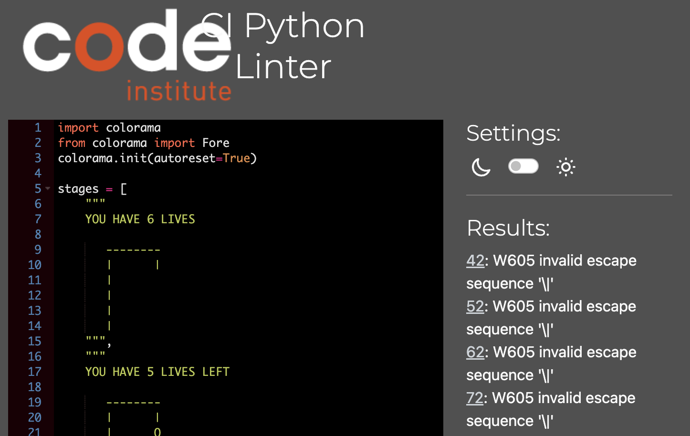

# Testing
## Manual testing (PEP8 linter validator testing)

### run.py showed no errors.

### words_for_hangman.py showed no errors.

### hangman_stages.py

Showed 4 errors. These errors will get ignored because it is the hangman figure art.

### hangman_figure.py

Showed 1 errors. This error will get ignored because it is the hangman figure art.

---

## Manual testing (local terminal and Code Institute Heroku terminal)

| Test | Expected Result | Tested | Passed |
| --- | --- | --- | --- |
| Start the application | The application should start without any errors.  It should display the main menu | Yes | Yes |
| Select "Instructions" from the main menu | The game instructions should be displayed. | Yes | Yes |
| Select "Go back" after visiting "Instructions" | When pressed enter, the main menu should be displayed. | Yes | Yes |
| Select "Play" in the main menu | The Hangman game should start and present a welcoming message together with print statments that assures the player that the game has started. The first hangman stage, and an input field should also be displayed.| Yes | Yes |
| Guess a correct letter | If the player guesses a correct letter that is in the secret word, the letter should take the underscore/underscores place. | Yes | Yes |
| Guess an incorrect letter | If the player guesses an incorrect letter that is not in the secret word, the next hangman stage should be displayed. | Yes | Yes |
| Typing an invalid character | If the player types a special character or number, an error message should be shown. | Yes | Yes |
| If player makes six incorrect guesses | The last hangman stage and the correct word should be displayed. Also a "You lose" message should be shown. | Yes | Yes |
| Guess all letters correctly | If the player guesses all the letters correctly a "You won" message should be shown. | Yes | Yes |
| Select "Go back" after winning or losing | When pressed enter, the main menu should be displayed. | Yes | Yes |

___

# User experience testing
The application was tested on 7 different people, in different age groups. The feedback recieved was very helpful. One of the individuals mentioned that some text appeared to "melt in to eachother a bit too much". I adressed this by implementing extra line breaks, "/n". Another indvidual suggested to add some artwork to the home menu page. I adressed this by implementing the hangman_figure.py art piece and I also decorated the headline with some special characters. Overall, the feedback was positive and the users found the game entertaining.

---